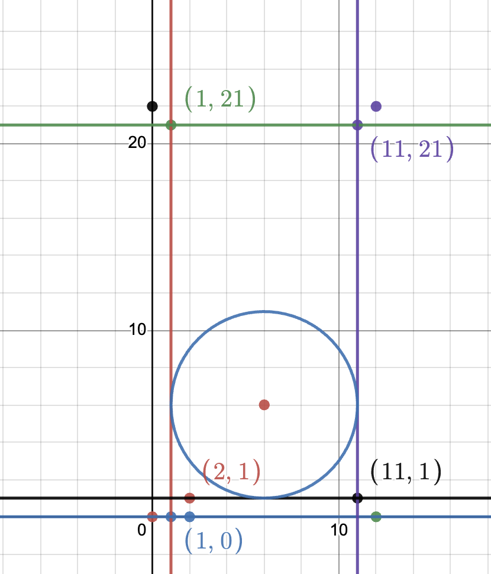
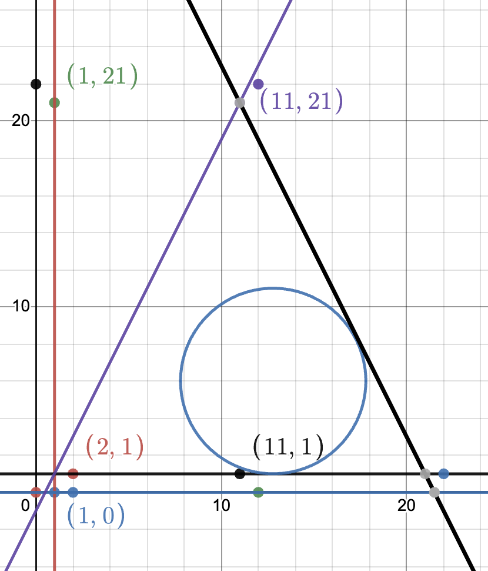

# UVa P12314
## Description
### You are tasked with ensuring the maximum efficiency of a cleaning robot. 
This robot is designed in the shape of a perfect disc with a given radius r. Given a polygonal obstacle, you need to strategically place the robot in an empty space such that it can clean the maximum possible area without any obstructions.

During its cleaning cycle, the robot should not cross or go through the obstacle, although merely touching the obstacle is permitted. A crucial constraint is that the robot should always remain within a confined area, meaning it should be "trapped" by the obstacle. If not, there's a risk that the robot could drift away and be lost indefinitely.

If the cordinates corresponds to a rectangle, use the radius to make a square, then subtract the area of the circle from the rectangle and divide by 4 to find the area of the corner that the robot will be unable reach. so if its a square or a rectangle just multiply that corner by 4 and subtract it from the total area of the rectangle/square.

